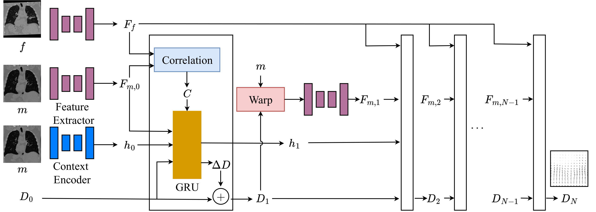

# Updated Readme for RWCNet (Animesh)
After following the original instructions of RWCNet code for setting up the environment. I used the following command to run the code:

1. To get the `dest_min` and `dset_max` values for the dataset, I used the following command:
```
python get_dataset_min_max.py <path_to_dataset_images_folder>
```
2. After getting the `dest_min` and `dset_max` values, add the new values in the train config file of the dataset. After this, I used the following command to train the model:
```
python l2r_train_eval.py <path_to_dataset_json_file> <train_config_json_file_of_dataset>
```
3. To evaluate the model using the saved model checkpoints, I used the following command:
```
python eval.py <path_to_dataset_json_file> <eval_config_json_file_of_dataset> 
```

Evaluation script will save the results in the `metrics.json` file.

To calculate the average metrics, I used the following command:
```
python avg_val.py
```
Currently, path of the `metrics.json` is hardcoded in the `avg_val.py` file. So, please change the path of the `metrics.json` file in the `avg_val.py` file before running the command.

I have added the `train_config_json` file in the `train_{dataset}` folder. 

# RWCNet

This is the official repository for RWCNet



## Setup

```
pip install -r requirements.txt
```

## Training
* Currently, the model caches the hidden tensors as well as the flows at each level. This ends up taking **a lot** of space.
* The model training can be configured using the train_config.json. The options for the configuration can be inferred from `config.py`
* When running the full model against L2R data, please use the data format used for the L2R 2022 challenge.

To train the model on L2R data:

```
python l2r_train_eval.py l2r_dataset_json.json train_config.json
```

## Publication

If you find this repository useful, please cite:

    Recurrence With Correlation Network for Medical Image Registration
    Vignesh Sivan, Teodora Vujovic, Raj Ranabhat, Alexander Wong, Stewart Mclachlin, Michael Hardisty
    eprint arXiv:2302.02283
